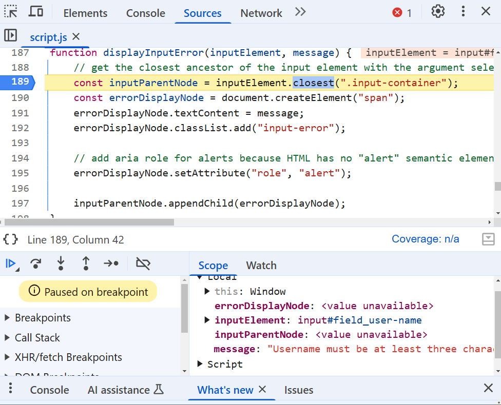
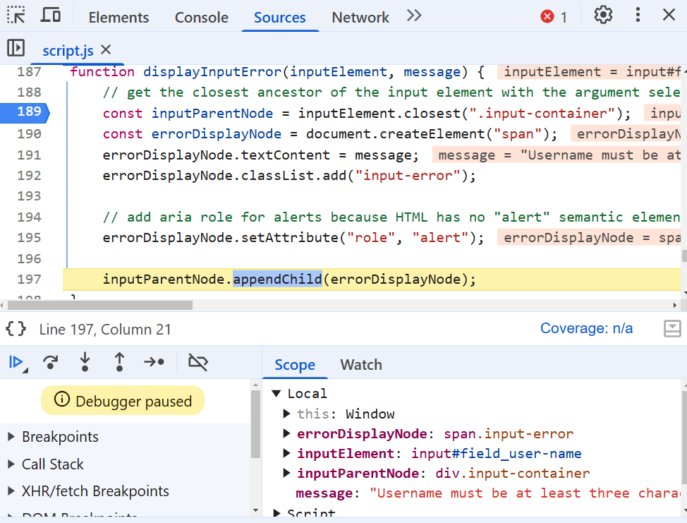

# Debugging Analysis
## Breakpoint Analysis
### 1-1
This breakpoint is at the first line of the `displayInputError()` function, invoked by a function that validates a user's input for a username.

The DOM Node representing the Username input element has been provided as an argument, alongside a string argument for the associated error message.

### 1-2
As the screenshot demonstrates, `inputParentNode` has been supplied a value by getting the first ancestor of the `inputElement` that has the `.input-container` class. 

The `errorDisplayNode` constant has also been initialized as a `` node. Its `textContent` property has been assigned to whatever was received as the `message` argument, and it has had the `input-error` class and `alert` role attributes added to it.

On line 197, the `appendChild()` method is invoked on the `inputParentNode` which will cause our new `errorDisplayNode` to appear on the screen.

This matches our intended behaviour for the function, which is to find the appropriate parent of whatever element needs an error message displayed for it, and append a span with the appropriate message.

## Critical State Analysis
This function is intentionally isolated from the rest of our code, so all that it indicates is that there is an `input` element with the id of `field_user-name` that has been queried and passed to the function alongside the `message` string. The function is written so that any node can be supplied alongside any kind of error message to the function, so long as that node has a parent with the `input-container` class.

This suggests that the function is meant to be used repeatedly for different `input` nodes with their own `input-container` parents. The fact that the function has been invoked at least once (since the breakpoint has been reached) indicates that we have at least one input that will display an error message.